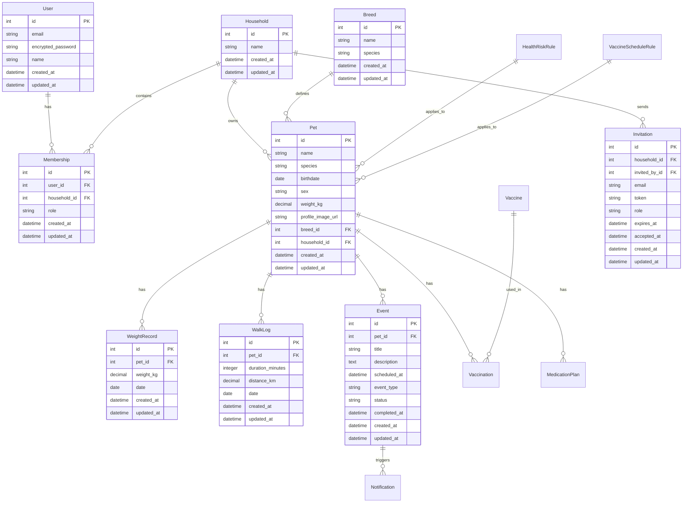
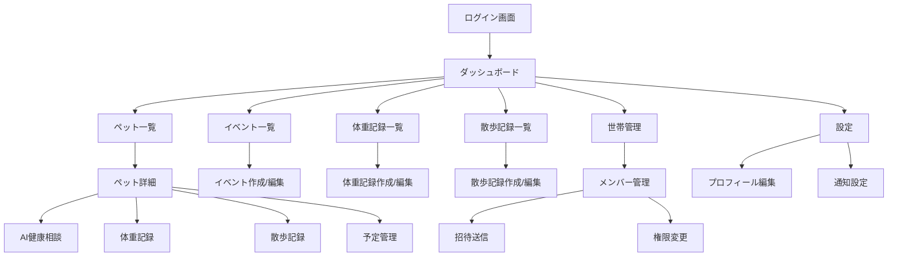

# ペット健康管理アプリケーション

## アプリケーション概要

このアプリケーションでできることを記載。

このアプリケーションは、ペットの健康管理を効率的に行うための包括的なプラットフォームです。以下の機能を提供します：

- **ペット登録・管理**: 複数頭のペットを登録し、個別の健康情報を管理
- **スケジュール管理**: ワクチン接種、投薬、健診などの予定を一元管理
- **AI健康相談**: 生成AIを活用した個別の健康相談機能
- **家族共有**: 世帯単位でペットの健康情報を共有
- **通知システム**: メールによる予定通知とリマインダー
- **ダッシュボード**: 今月の予定、未完了タスク、最近の完了事項を一覧表示
- **健康記録管理**: 体重記録と散歩記録の管理

## URL

**本番環境**: https://pet-health2.onrender.com

## テスト用アカウント

- **メールアドレス**: test@test.jp
- **パスワード**: asd123

※本番環境では、デモ用のサンプルデータが自動生成されます。

## 利用方法

このアプリケーションの利用方法を記載。説明が長い場合は、箇条書きでリスト化すること。

### 1. アカウント作成・ログイン
- 新規ユーザー登録またはテストアカウントでログイン

### 2. 世帯作成
- 初回ログイン時に世帯を作成
- 世帯名を設定して家族共有の基盤を構築

### 3. ペット登録
- ダッシュボードから「ペットを追加」をクリック
- ペットの基本情報（名前、犬種、生年月日など）を入力

### 4. 健康記録の管理
- **体重記録**: 定期的な体重測定データを記録
- **散歩記録**: 散歩の時間と距離を記録

### 5. AI機能の活用
- **AI健康相談**: 具体的な質問に対するAI回答

### 6. 予定管理
- ワクチン接種、投薬、健診などの予定を登録
- メール通知によるリマインダー機能

### 7. 家族共有
- 世帯メンバーを招待してペットの健康情報を共有
- メンバーの権限管理（オーナー・編集者・閲覧者）

## アプリケーションを作成した背景

このアプリケーションを通じて、どのような人の、どのような課題を解決しようとしているのかを記載。

ペットを飼っている家族の多くが直面する課題として、以下の問題があります：

- **健康管理の複雑さ**: ワクチン接種スケジュール、投薬管理、定期健診など、複雑な健康管理タスク
- **家族間の情報共有不足**: 家族全員がペットの健康状態を把握できていない
- **専門知識の不足**: ペットの健康に関する専門的なアドバイスが得られない
- **記録管理の煩雑さ**: 体重や散歩などの記録を手動で管理する負担

このアプリケーションは、これらの課題を解決し、ペットの健康管理をより簡単で効果的にすることを目的としています。特に、AI技術を活用することで、専門的な健康アドバイスを提供し、ペットオーナーの不安を軽減します。

## 実装した機能についての画像やGIFおよびその説明※

実装した機能について、それぞれどのような特徴があるのかを列挙する形で記載。画像はGyazoで、GIFはGyazoGIFで撮影すること。

### 1. ダッシュボード機能
- **特徴**: 今月の予定、未完了タスク、最近の完了事項、登録ペット数を一覧表示
- **工夫点**: 各カードをクリック可能にして、詳細ページへの遷移をスムーズに実装
- **UI/UX**: グラデーション背景とガラスモーフィズムデザインを採用

### 2. AI健康相談機能
- **特徴**: ユーザーが自由に質問を入力し、AIが専門的な回答を提供
- **工夫点**: リアルタイムでの質問応答と、回答のタイピングアニメーション表示
- **技術**: OpenAI GPT-4o-miniを活用した高精度な回答生成

### 3. ペット管理機能
- **特徴**: 複数頭のペットを登録・管理し、個別の健康記録を保持
- **工夫点**: 直感的なUI/UXでペット情報の入力・編集を簡単に実現
- **デザイン**: ペットのアバター表示とステータスバッジによる視覚的な管理

### 4. 体重・散歩記録機能
- **特徴**: 定期的な体重測定と散歩記録の管理
- **工夫点**: グラフ表示による視覚的なデータ確認と、AI分析との連携
- **統計**: 週間・月間の集計データを自動計算

### 5. 家族共有機能
- **特徴**: 世帯単位でのペット情報共有とメンバー管理
- **工夫点**: 招待メール機能と権限管理システム
- **セキュリティ**: トークンベースの招待システムとロールベースアクセス制御

### 6. 予定管理機能
- **特徴**: ワクチン、投薬、健診などの予定を一元管理
- **工夫点**: メール通知によるリマインダー機能
- **自動化**: バックグラウンドジョブによる通知の自動送信

## 実装予定の機能

洗い出した要件の中から、今後実装予定の機能がある場合は、その機能を記載。

- **カレンダー表示**: 月間・週間カレンダーでの予定表示
- **写真アップロード**: ペットの写真管理機能
- **健康記録の詳細化**: より詳細な健康指標の記録
- **家族間チャット**: ペットに関する家族間のコミュニケーション機能
- **獣医師連携**: 獣医師との情報共有機能
- **モバイルアプリ**: iOS/Androidアプリの開発
- **AI健康アドバイス**: ペットの健康状態に基づいた個別アドバイス
- **AI健康分析**: 体重や散歩データの分析と傾向の可視化

## データベース設計

ER図を添付。



## 画面遷移図

画面遷移図を添付。



## 開発環境

使用した言語・サービスを記載。

- **言語**: Ruby 3.2.0
- **フレームワーク**: Ruby on Rails 7.1.5
- **データベース**: PostgreSQL 15
- **フロントエンド**: HTML5, CSS3, Vanilla JavaScript
- **認証**: Devise
- **バックグラウンドジョブ**: Sidekiq + Redis
- **AI API**: OpenAI GPT-4o-mini
- **デプロイ**: Render
- **バージョン管理**: Git + GitHub
- **テスト**: RSpec, Capybara
- **コード品質**: RuboCop

## ローカルでの動作方法

git cloneしてから、ローカルで動作をさせるまでに必要なコマンドを記載。

### 1. リポジトリのクローン
```bash
git clone https://github.com/taiyifuyuan2/pet-health2.git
cd pet-health2
```

### 2. 依存関係のインストール
```bash
bundle install
```

### 3. データベースのセットアップ
```bash
bin/setup
```

### 4. 環境変数の設定
```bash
# .envファイルを作成
echo "OPENAI_API_KEY=your_openai_api_key_here" > .env
```

### 5. 開発サーバーの起動
```bash
# ターミナル1: Webサーバー
bin/rails server

# ターミナル2: Sidekiqワーカー
bundle exec sidekiq
```

### 6. アクセス
- アプリケーション: http://localhost:3000
- テストユーザー: test@example.com / password

## 工夫したポイント

制作背景・使用技術・開発方法・タスク管理など、企業へPRしたい事柄を記載。

### 技術的な工夫
- **AI技術の活用**: OpenAI GPT-4o-miniを活用した個別の健康相談機能
- **レスポンシブデザイン**: モバイルファーストのアプローチで、あらゆるデバイスに対応
- **非同期処理**: Sidekiqを使用したバックグラウンドジョブによる通知機能
- **タイピングアニメーション**: JavaScriptによる動的なUI表現でユーザー体験を向上
- **ガラスモーフィズムデザイン**: 現代的なUI/UXデザインの採用

### 開発方法の工夫
- **テスト駆動開発**: RSpecを使用した包括的なテストカバレッジ
- **段階的な機能実装**: 基本機能からAI機能まで段階的に実装
- **ユーザビリティ重視**: 直感的なUI/UX設計とユーザーフィードバックの反映
- **コード品質管理**: RuboCopを使用した一貫したコードスタイルの維持

### タスク管理
- **GitHub Issues**: 機能実装とバグ修正の管理
- **コミットメッセージ**: 明確で分かりやすいコミットメッセージの記述
- **コードレビュー**: 自己レビューによるコード品質の向上
- **継続的インテグレーション**: 自動テストによる品質保証

### セキュリティ
- **認証システム**: Deviseを使用した堅牢な認証機能
- **権限管理**: ロールベースアクセス制御による適切な権限管理
- **招待システム**: トークンベースの安全な招待機能

## 改善点

より改善するとしたらどこか、それはどのようにしてやるのか。

### 短期的な改善
- **パフォーマンス最適化**: データベースクエリの最適化とN+1問題の解決
- **エラーハンドリング**: より詳細なエラーメッセージとユーザーフレンドリーな表示
- **テストカバレッジ**: より包括的なテストケースの追加
- **UI/UX改善**: より直感的なインターフェースの実装

### 中長期的な改善
- **マイクロサービス化**: 機能ごとのサービス分割によるスケーラビリティの向上
- **リアルタイム機能**: WebSocketを使用したリアルタイム通知機能
- **機械学習の活用**: より高度なAI機能と予測分析の実装
- **モバイルアプリ**: ネイティブアプリの開発による利便性の向上
- **API化**: RESTful APIの提供による他システムとの連携

### 具体的な改善方法
- **キャッシュ戦略**: Redisを使用したデータキャッシュの実装
- **CDN導入**: 静的アセットの配信最適化
- **監視システム**: アプリケーションのパフォーマンス監視
- **ログ分析**: ユーザー行動の分析と改善点の特定

## 制作時間

アプリケーションを制作するのにかけた時間。

- **企画・設計**: 約20時間
- **基本機能実装**: 約40時間
- **AI機能実装**: 約30時間
- **UI/UX改善**: 約25時間
- **テスト・デバッグ**: 約20時間
- **デプロイ・運用**: 約15時間
- **家族共有機能実装**: 約20時間

**合計**: 約170時間（約4.5週間）

---

## ライセンス

MIT License