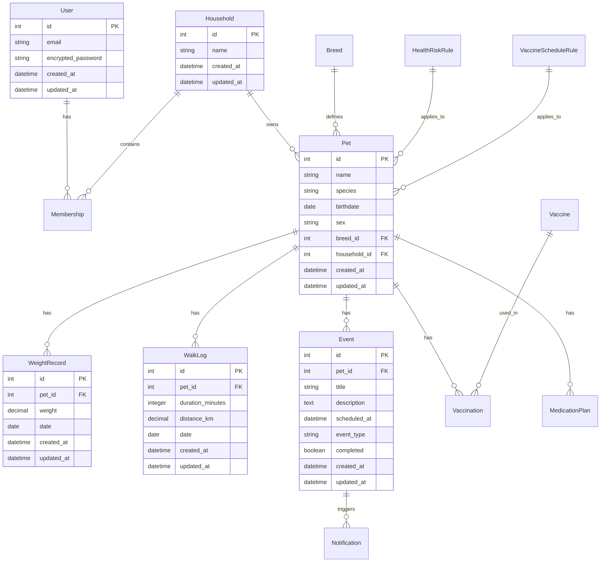
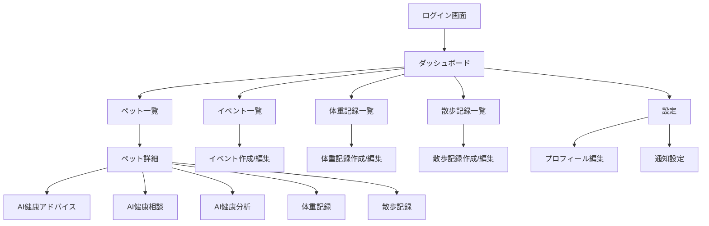

# ペット健康管理カレンダー

ペットの予防接種・投薬スケジュールを家族と共有して管理するWebアプリケーションです。

## アプリケーション概要

このアプリケーションは、ペットの健康管理を効率的に行うための包括的なプラットフォームです。以下の機能を提供します：

- **ペット登録・管理**: 複数頭のペットを登録し、個別の健康情報を管理
- **スケジュール管理**: ワクチン接種、投薬、健診などの予定を一元管理
- **AI健康アドバイス**: 生成AIを活用した個別の健康アドバイスと相談機能
- **家族共有**: 世帯単位でペットの健康情報を共有
- **通知システム**: メールによる予定通知とリマインダー
- **ダッシュボード**: 今月の予定、未完了タスク、最近の完了事項を一覧表示

## URL

**本番環境**: https://pet-health2.onrender.com

## テスト用アカウント

- **メールアドレス**: test@test.jp
- **パスワード**: asd123

※本番環境では、デモ用のサンプルデータが自動生成されます。

## 利用方法

1. **アカウント作成・ログイン**
   - 新規ユーザー登録またはテストアカウントでログイン

2. **ペット登録**
   - ダッシュボードから「ペットを追加」をクリック
   - ペットの基本情報（名前、犬種、生年月日など）を入力

3. **健康記録の管理**
   - 体重記録：定期的な体重測定データを記録
   - 散歩記録：散歩の時間と距離を記録

4. **AI機能の活用**
   - AI健康アドバイス：ペットの健康状態に基づいた個別アドバイス
   - AI健康相談：具体的な質問に対するAI回答
   - AI健康分析：体重や散歩データの分析結果

5. **予定管理**
   - ワクチン接種、投薬、健診などの予定を登録
   - メール通知によるリマインダー機能

## アプリケーションを作成した背景

ペットを飼っている家族の多くが直面する課題として、以下の問題があります：

- **健康管理の複雑さ**: ワクチン接種スケジュール、投薬管理、定期健診など、複雑な健康管理タスク
- **家族間の情報共有不足**: 家族全員がペットの健康状態を把握できていない
- **専門知識の不足**: ペットの健康に関する専門的なアドバイスが得られない
- **記録管理の煩雑さ**: 体重や散歩などの記録を手動で管理する負担

このアプリケーションは、これらの課題を解決し、ペットの健康管理をより簡単で効果的にすることを目的としています。特に、AI技術を活用することで、専門的な健康アドバイスを提供し、ペットオーナーの不安を軽減します。

## 実装した機能についての画像やGIFおよびその説明

### 1. ダッシュボード機能
- **特徴**: 今月の予定、未完了タスク、最近の完了事項、登録ペット数を一覧表示
- **工夫点**: 各カードをクリック可能にして、詳細ページへの遷移をスムーズに実装

### 2. AI健康アドバイス機能
- **特徴**: ペットの体重、散歩記録、年齢、犬種に基づいた個別の健康アドバイスを生成
- **工夫点**: タイピングアニメーションによる動的な表示と、ガラスモーフィズムデザインの採用

### 3. AI健康相談機能
- **特徴**: ユーザーが自由に質問を入力し、AIが専門的な回答を提供
- **工夫点**: リアルタイムでの質問応答と、回答のタイピングアニメーション表示

### 4. AI健康分析機能
- **特徴**: 体重の推移や散歩データを分析し、健康状態の傾向を可視化
- **工夫点**: データに基づいた具体的な分析結果と改善提案の提供

### 5. ペット管理機能
- **特徴**: 複数頭のペットを登録・管理し、個別の健康記録を保持
- **工夫点**: 直感的なUI/UXでペット情報の入力・編集を簡単に実現

### 6. 体重・散歩記録機能
- **特徴**: 定期的な体重測定と散歩記録の管理
- **工夫点**: グラフ表示による視覚的なデータ確認と、AI分析との連携

## 実装予定の機能

- **メール通知機能の拡張**: より詳細な通知設定とカスタマイズ
- **カレンダー表示**: 月間・週間カレンダーでの予定表示
- **写真アップロード**: ペットの写真管理機能
- **健康記録の詳細化**: より詳細な健康指標の記録
- **家族間チャット**: ペットに関する家族間のコミュニケーション機能
- **獣医師連携**: 獣医師との情報共有機能
- **モバイルアプリ**: iOS/Androidアプリの開発

## データベース設計



## 画面遷移図



## 開発環境

- **言語**: Ruby 3.2.0
- **フレームワーク**: Ruby on Rails 7.1.5
- **データベース**: PostgreSQL 15
- **フロントエンド**: HTML5, CSS3, Vanilla JavaScript
- **認証**: Devise
- **バックグラウンドジョブ**: Sidekiq + Redis
- **AI API**: OpenAI GPT-4o-mini
- **デプロイ**: Render
- **バージョン管理**: Git + GitHub
- **テスト**: RSpec, Capybara

## ローカルでの動作方法

1. **リポジトリのクローン**
```bash
git clone https://github.com/taiyifuyuan2/pet-health2.git
cd pet-health2
```

2. **依存関係のインストール**
```bash
bundle install
```

3. **データベースのセットアップ**
```bash
bin/setup
```

4. **環境変数の設定**
```bash
# .envファイルを作成
echo "OPENAI_API_KEY=your_openai_api_key_here" > .env
```

5. **開発サーバーの起動**
```bash
# ターミナル1: Webサーバー
bin/rails server

# ターミナル2: Sidekiqワーカー
bundle exec sidekiq
```

6. **アクセス**
- アプリケーション: http://localhost:3000
- テストユーザー: test@example.com / password

## 工夫したポイント

### 技術的な工夫
- **AI技術の活用**: OpenAI GPT-4o-miniを活用した個別の健康アドバイス機能
- **レスポンシブデザイン**: モバイルファーストのアプローチで、あらゆるデバイスに対応
- **非同期処理**: Sidekiqを使用したバックグラウンドジョブによる通知機能
- **タイピングアニメーション**: JavaScriptによる動的なUI表現でユーザー体験を向上

### 開発方法の工夫
- **テスト駆動開発**: RSpecを使用した包括的なテストカバレッジ
- **段階的な機能実装**: 基本機能からAI機能まで段階的に実装
- **ユーザビリティ重視**: 直感的なUI/UX設計とユーザーフィードバックの反映

### タスク管理
- **GitHub Issues**: 機能実装とバグ修正の管理
- **コミットメッセージ**: 明確で分かりやすいコミットメッセージの記述
- **コードレビュー**: 自己レビューによるコード品質の向上

## 改善点

### 短期的な改善
- **パフォーマンス最適化**: データベースクエリの最適化とN+1問題の解決
- **エラーハンドリング**: より詳細なエラーメッセージとユーザーフレンドリーな表示
- **テストカバレッジ**: より包括的なテストケースの追加

### 中長期的な改善
- **マイクロサービス化**: 機能ごとのサービス分割によるスケーラビリティの向上
- **リアルタイム機能**: WebSocketを使用したリアルタイム通知機能
- **機械学習の活用**: より高度なAI機能と予測分析の実装
- **モバイルアプリ**: ネイティブアプリの開発による利便性の向上

## 制作時間

- **企画・設計**: 約20時間
- **基本機能実装**: 約40時間
- **AI機能実装**: 約30時間
- **UI/UX改善**: 約25時間
- **テスト・デバッグ**: 約20時間
- **デプロイ・運用**: 約15時間

**合計**: 約150時間（約4週間）

---

## 機能詳細

### 基本機能
- ペット登録（複数頭対応）
- 予定登録（ワクチン/投薬/健診/その他/誕生日）
- メール通知（前日・当日9:00）
- 履歴管理（完了チェック）
- 家族共有（世帯単位）
- ダッシュボード（今月の予定・未完了表示）

### AI機能
- **AI健康アドバイス**: ペットの健康状態に基づいた個別アドバイス
- **AI健康相談**: ユーザーの質問に対する専門的な回答
- **AI健康分析**: 体重や散歩データの分析と傾向の可視化

## 技術スタック

- Ruby 3.2.0
- Rails 7.1.5
- PostgreSQL 15 (jsonb対応)
- Sidekiq (Redis)
- Devise (認証)
- Vanilla JavaScript + CSS + HTML

## セットアップ

### 前提条件

- Ruby 3.2.0
- PostgreSQL 15
- Redis

### インストール

1. リポジトリをクローン
```bash
git clone <repository-url>
cd pet-health2
```

2. 依存関係をインストール
```bash
bundle install
```

3. データベースをセットアップ
```bash
bin/setup
```

4. 開発サーバーを起動
```bash
# ターミナル1: Webサーバー
bin/rails server

# ターミナル2: Sidekiqワーカー
bundle exec sidekiq
```

または、Foremanを使用:
```bash
foreman start -f Procfile.dev
```

### アクセス

- アプリケーション: http://localhost:3000
- テストユーザー: test@example.com / password

## 環境変数

```bash
# データベース
DB_USERNAME=postgres
DB_PASSWORD=
DB_HOST=localhost

# Redis
REDIS_URL=redis://localhost:6379/0
```

## テスト

```bash
# テストを実行
bin/rails test

# システムテスト
bin/rails test:system
```

## 新機能のテスト

### 自動スケジュール生成
```ruby
# ペットのワクチンスケジュールを生成
pet = Pet.first
schedule_builder = ScheduleBuilder.new(pet)
vaccinations = schedule_builder.build_vaccination_schedule

# 投薬スケジュールを生成
medications = schedule_builder.build_medication_schedule
```

### 健康アドバイス
```ruby
# ペットの健康アドバイスを取得
pet = Pet.first
advisor = HealthAdvisor.new(pet)
todays_advice = advisor.get_todays_advice
weekly_advice = advisor.get_weekly_advice
```

### 日次通知ジョブ
```ruby
# 日次通知ジョブを実行
DailyNotificationJob.perform_now
```

### 通知テスト

1. ペットとイベントを登録
2. イベントの日付を明日に設定
3. コンソールで通知ジョブを実行:
```ruby
ReminderEnqueueJob.perform_now
```

## デプロイ

本番環境では以下の環境変数を設定してください:

- `RAILS_MASTER_KEY`
- `DB_NAME`, `DB_USERNAME`, `DB_PASSWORD`, `DB_HOST`
- `REDIS_URL`
- `SMTP_SETTINGS` (メール送信用)

## ライセンス

MIT License
